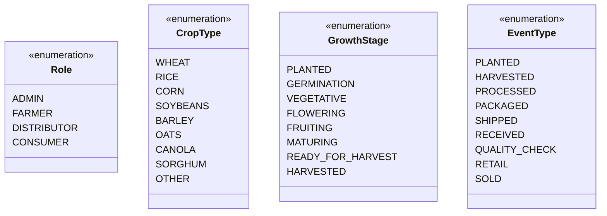
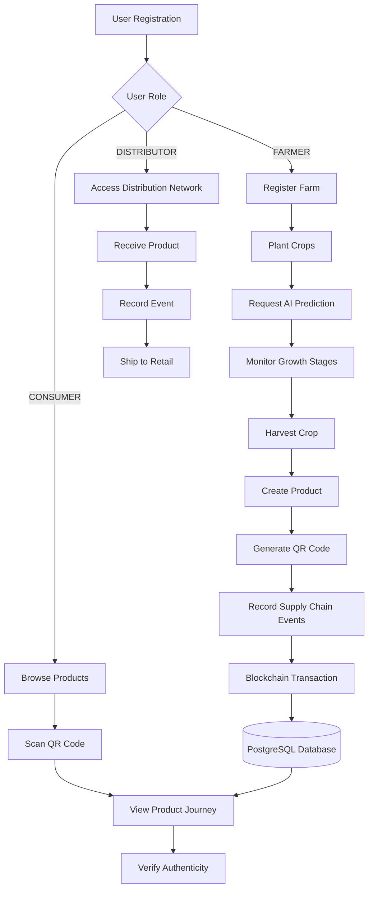
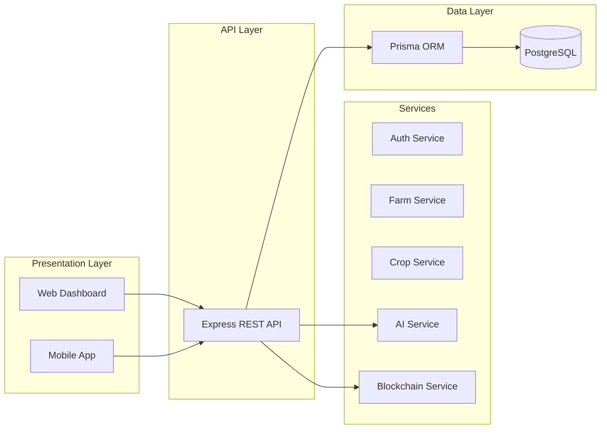
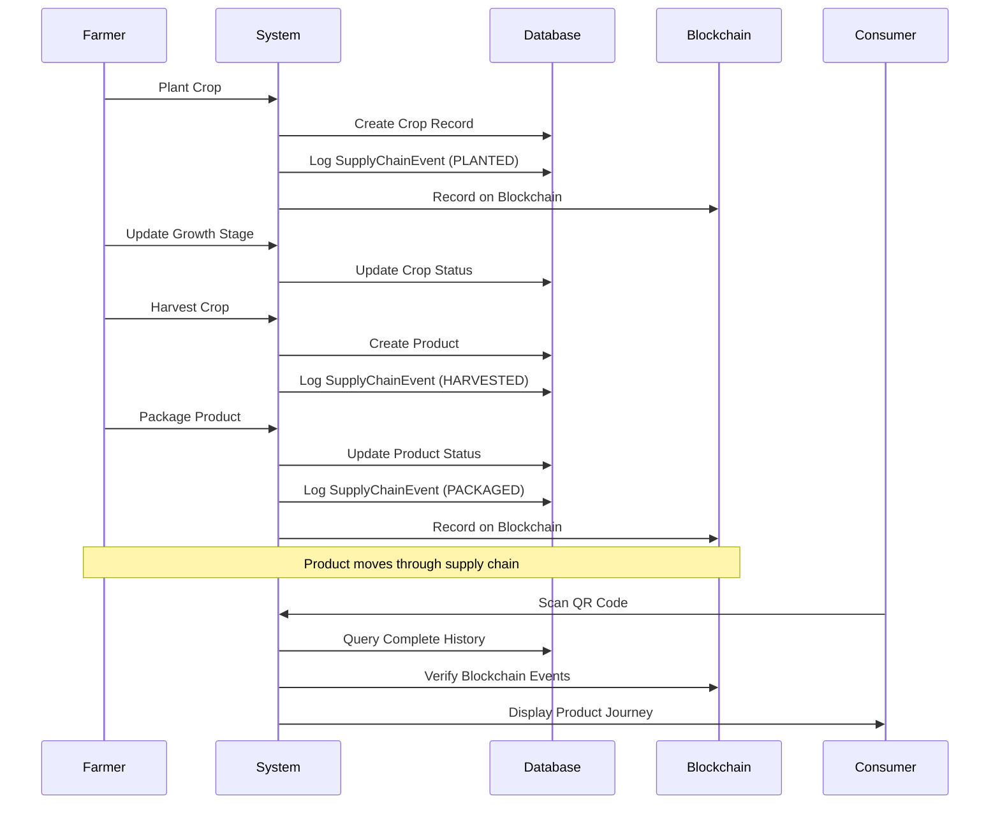
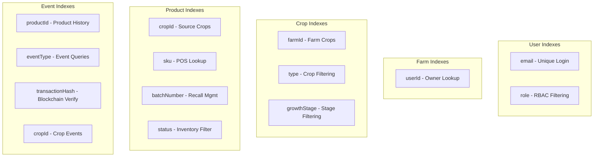
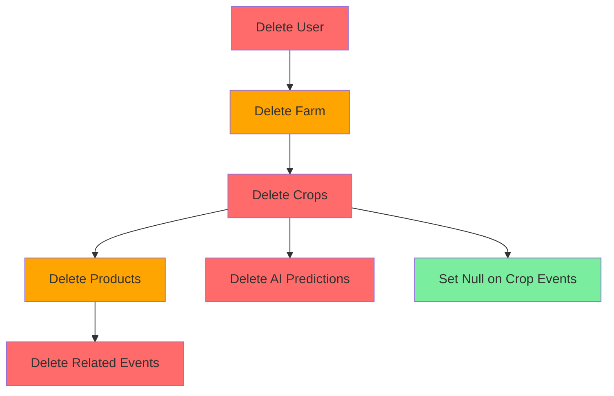
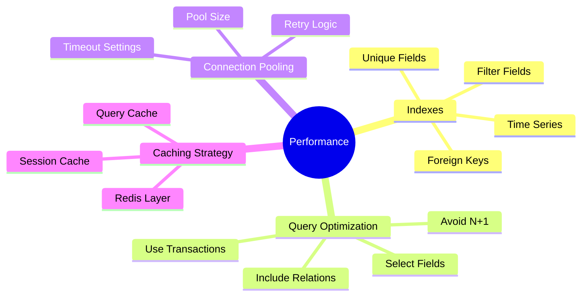

# FarmConnect Database Schema - Visual Diagram

## Entity Relationship Diagram (ERD)

```mermaid
erDiagram
    User ||--o| Farm : "owns (1:1)"
    User ||--o{ SupplyChainEvent : "acts in"
    Farm ||--o{ Crop : "contains"
    Crop ||--o{ Product : "produces"
    Crop ||--o{ AIPrediction : "has predictions"
    Crop ||--o{ SupplyChainEvent : "tracked by"
    Product ||--o{ SupplyChainEvent : "tracked by"

    User {
        uuid id PK
        string email UK
        string password
        string firstName
        string lastName
        Role role
        string phone
        datetime createdAt
        datetime updatedAt
    }

    Farm {
        uuid id PK
        string name
        string description
        json location
        float size
        string certification
        uuid userId FK UK
        datetime createdAt
        datetime updatedAt
    }

    Crop {
        uuid id PK
        string name
        CropType type
        string variety
        datetime plantingDate
        datetime expectedHarvest
        GrowthStage growthStage
        float area
        float estimatedYield
        float actualYield
        uuid farmId FK
        string qrCode UK
        datetime createdAt
        datetime updatedAt
    }

    Product {
        uuid id PK
        string name
        string sku UK
        uuid cropId FK
        float quantity
        datetime packagingDate
        datetime expiryDate
        string batchNumber
        string storageLocation
        string status
        datetime createdAt
        datetime updatedAt
    }

    AIPrediction {
        uuid id PK
        uuid cropId FK
        float predictedYield
        float confidence
        json factors
        datetime createdAt
    }

    SupplyChainEvent {
        uuid id PK
        string productId
        EventType eventType
        datetime timestamp
        string location
        uuid actorId FK
        string metadata
        string transactionHash UK
        int blockNumber
        boolean verified
        datetime createdAt
    }

    AuditLog {
        uuid id PK
        string action
        string entity
        string entityId
        string userId
        datetime timestamp
        json details
    }
```

## Enum Types



## Data Flow Diagram



## Architecture Layers



## Supply Chain Event Flow



## Index Strategy



## Cascade Delete Flow



## Query Performance



---

**Legend:**
- PK = Primary Key
- UK = Unique Key
- FK = Foreign Key
- JSON = JSONB data type

For detailed field descriptions and usage examples, see [SCHEMA_DOCS.md](./SCHEMA_DOCS.md)
